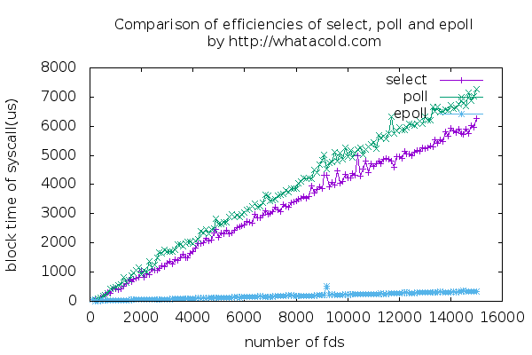

As we already know, there are three I/O multiplexing mechanisms on Linux: select(2), poll(2) and epoll(7).
And epoll scales far more better than select and poll, as in wikipedia[1]:

> unlike the older system calls, which operate in O(n) time, epoll operates in O(1) time

But it seems that there is no such a chart that we can tell
the performance differences in the very first sight.

So here it is.
This repo demostrates how these three mechanisms differ in performance
when watching various number of fds, from small to large.

It works as below:

1. open specified number of sockets, where no data will be received.

1. open a "special" socket, say ss, where data would be received constantly.

1. use a multiplexing mechanism to watch some "normal" sockets in setp 1 and `ss`,
count the time it consumes before notifying there is data comes in `ss`.

# How to run the code

    # make
    # su # login as root
    # ./run.sh

After above operations, the chart `multiplexing_compare.png` will be rendered and is what we want,
if everything goes fine. Check it out.

# A sample result

A picture is worth a thousand words.
Here is a sample chart in my Fedora 22 box, with 4-core 2.20GHZ Intel Core i5 CPU and 8GB RAM.

# Some notes

* `FD_SETSIZE` of select

    The four macros `FD_*`, which come with `select`, depend on a macro, `FD_SETSIZE`,
    which is 1024 in my box. What it means is that `select` could only watch fd less than 1024,
    that is definitely not what I want.

    So in order to break this limitation, I handle the bit array of fd myself.
    And it breaks the POSIX standard too.

* epoll

    the watched fd of epoll could not be a regular one, such as regular file fd.

# References

[1] [epoll - Wikipedia](https://en.wikipedia.org/wiki/Epoll)
